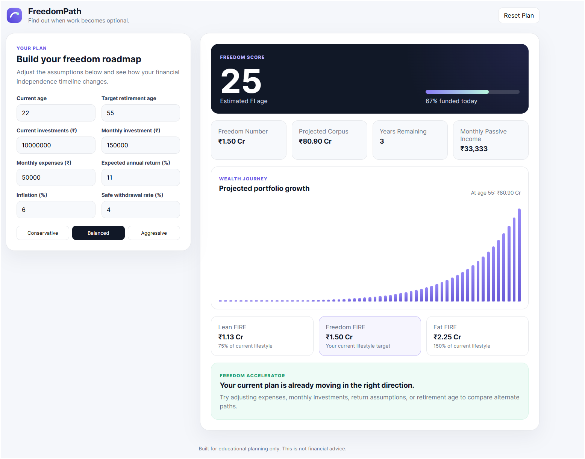
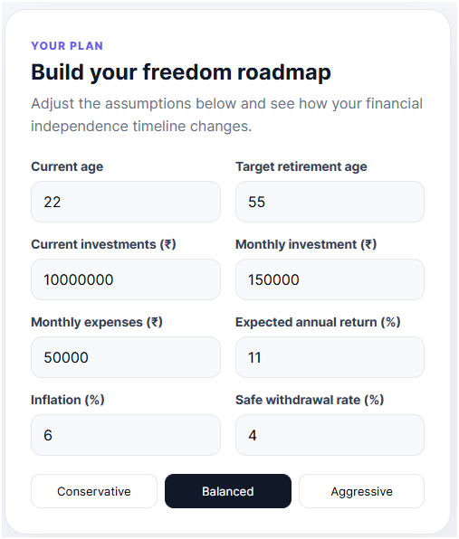
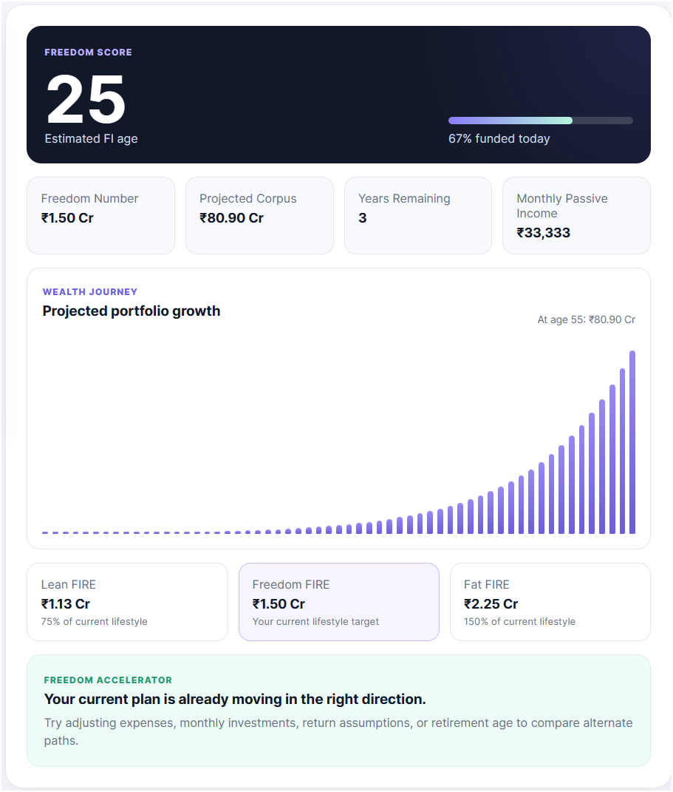
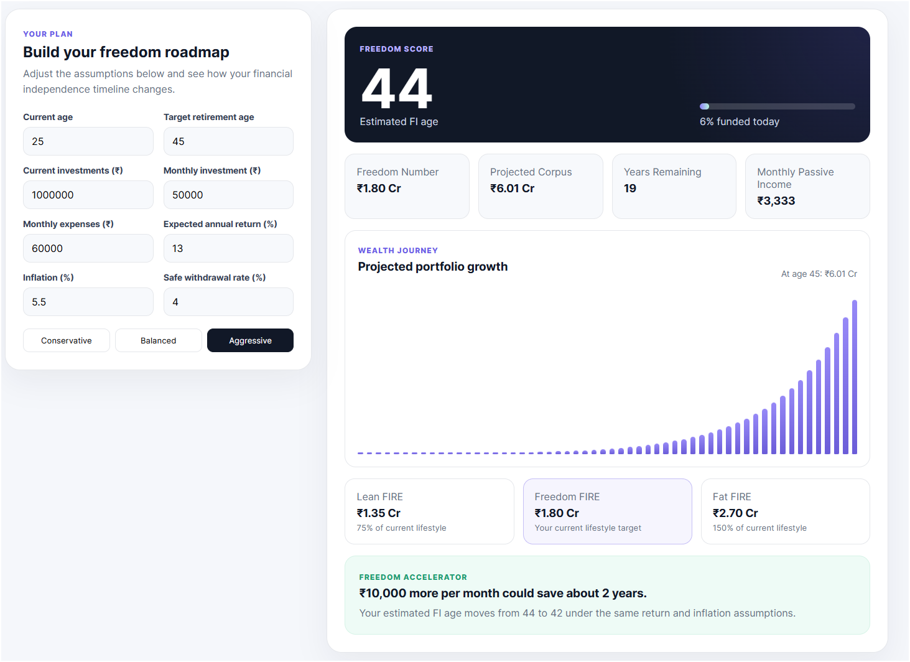

# FreedomPath — FIRE Calculator

FreedomPath is a browser-based financial independence planner built with **HTML, CSS, and vanilla JavaScript**.

It helps estimate how much money may be needed for financial independence, when that target could be reached, and how different assumptions around investing, expenses, inflation, returns, and withdrawal rates affect the outcome.

The project runs entirely in the browser and does not require a backend, framework, npm setup, or external database.

---

## Project Preview

### Dashboard Overview



### Financial Inputs



### FIRE Results & Projection



### Scenario Comparison



---

## Features

- FIRE / financial independence target calculation
- Estimated financial independence age
- Current FI progress percentage
- Projected portfolio value at target age
- Estimated monthly passive income
- Lean FIRE target
- Freedom FIRE target
- Fat FIRE target
- Conservative scenario
- Balanced scenario
- Aggressive scenario
- Wealth projection visualization
- Freedom Accelerator comparison
- Inflation-adjusted FIRE projections
- Safe withdrawal rate adjustment
- Indian lakh and crore number formatting
- Automatic recalculation when inputs change
- LocalStorage persistence
- Reset plan option
- Responsive desktop and mobile layout

---

## How It Works

FreedomPath uses a set of financial assumptions provided by the user:

- Current age
- Target retirement age
- Current investments
- Monthly investment amount
- Monthly expenses
- Expected annual investment return
- Inflation rate
- Safe withdrawal rate

The calculator then estimates a target FIRE corpus and simulates portfolio growth over time.

A simplified FIRE target can be represented as:

```text
Annual Expenses
----------------
Withdrawal Rate
